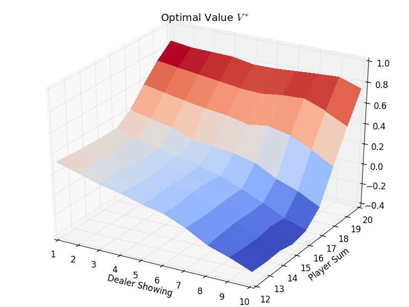

A game like blackjack except with full replacement and no aces as 1/11's.

## Reinforcement Learning approaches below.

#### Monte Carlo Control

Using GPI for Q optimzation, using time varying scalar step and &epsilon;-greedy exploration strategy.

#### TD Learning Sarsa Off Policy Control(&#955;)

Q*(s,a) = Q(s,a) + &alpha; &zeta;et(s,a) 

#### Linear Function Approximation

Q(s, a) = &#934;(s, a)&#932; &#952;

Using overlapping Coarse Coding for feature vector &#934; overlapping state space with player sum and dealer initial value.

